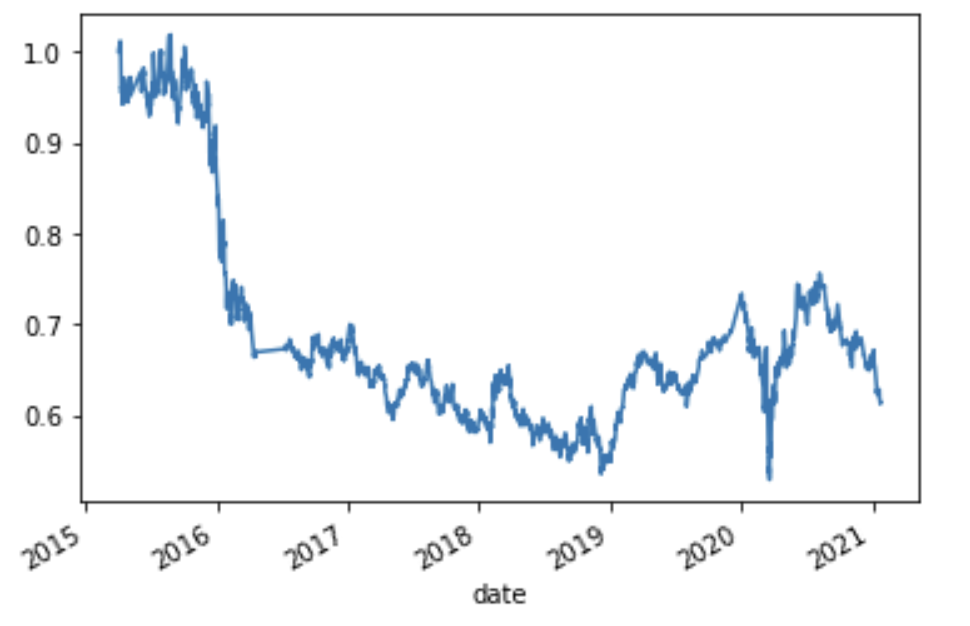

# Machine_Learning_Trading_Bot
 
Improving existing algorithmic trading systems by enhancing existing trading signals with machine learning algorithms that will adapt to new data.

---

## Technologies

This project leverages python 3.7 with the following:

* [JupyterLab](https://jupyterlab.readthedocs.io/en/stable/) - JupyterLab is a web-based user interface designed for data analysis.

* [pandas](https://github.com/pandas-dev/pandas) - Flexible and powerful data analysis / manipulation library for Python.

* [numpy](https://github.com/numpy/numpy) - The fundamental package for scientific computing with Python.

* [matplotlib inline](https://github.com/matplotlib/matplotlib) - Comprehensive library for creating static, animated, and interactive visualizations in Python.

* [sklearn](https://scikit-learn.org/stable/index.html) - Simple and efficient tools for predictive data analysis.

---

### Installation Guide

Before running the application first install the following dependencies.

```python
  pip install jupyterlab
  pip install pandas
  pip install numpy
  pip install matplotlib
  pip install sklearn
```

---

## Examples

**Setting short and long window to help with generating the fast and slow simple moving averages.**
```
short_window = 4
long_window = 100

signals_df['SMA_Fast'] = signals_df['close'].rolling(window=short_window).mean()
signals_df['SMA_Slow'] = signals_df['close'].rolling(window=long_window).mean()

signals_df = signals_df.dropna()

display(signals_df.head())
display(signals_df.tail())

```
**Initializing the Signal column to signal to buy stock long or sell stock short.**
```
signals_df['Signal'] = 0.0

signals_df.loc[(signals_df['Actual Returns'] >= 0), 'Signal'] = 1

signals_df.loc[(signals_df['Actual Returns'] < 0), 'Signal'] = -1

display(signals_df.head())
display(signals_df.tail())

```

**Instanciating SVC classifier model instance, fitting model to the data using training data, making and reviewing model predictions, creating a classification report to evaluate the model.**
```
svm_model = svm.SVC()
 
svm_model = svm_model.fit(X_train_scaled, y_train)
 
svm_pred = svm_model.predict(X_test_scaled)

svm_pred[:10]

svm_testing_report = classification_report(y_test, svm_pred)

print(svm_testing_report)
```

**Creating predictions DataFrame, adding SVM model, Actual Returns, and Strategy Returns.**
```
prediction_df = pd.DataFrame(index=X_test.index)

prediction_df['Predicted'] = pred

prediction_df['Actual Returns'] = signals_df['Actual Returns']

prediction_df['Strategy Returns'] = prediction_df['Actual Returns'] * prediction_df['Predicted']

display(prediction_df.head())
display(prediction_df.tail())
```

**Plotting the actual returns versus the strategy returns.**
```
(1 + prediction_df[["Actual Returns", "Strategy Returns"]]).cumprod().plot()
```
---

## Usage

To use the portfolio management application simply clone the repository and run the **machine_learning_trading_bot.py** with:

```python
machine_learning_trading_bot.py
```

Below you will find screenshots of varios visualization demonstrations.




---

## Evaluation Report

Question: What impact resulted from increasing or decreasing the training window?


Question: What impact resulted from increasing or decreasing either or both of the SMA windows?

Answer: Increasing the SMA windows made the plots more accurate to actual returns.

Question: Did this new model perform better or worse than the provided baseline model?

Answer: The new model had the same performance as the provided baseline model up until the end of 2018 when the new model surpassed and outperformed the baseline model.

Question: Did this new model perform better or worse than your tuned trading algorithm?

Answer: The new model actually performed worse then the tuned trading algorithm.

## Contributors

Brought to you by Robert Giannini.
LinkedIn: https://www.linkedin.com/in/robertgianninijr/

---

## License

MIT